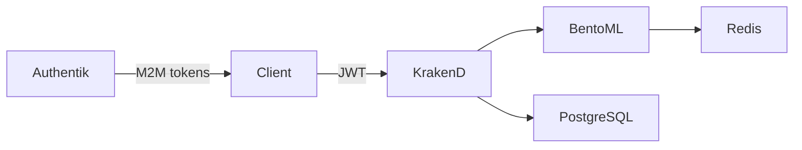

# Reusable Async ML API Platform

Codegen-driven async ML API platform on **Kubernetes**. Define a service in `services/<id>/service.yaml`; the generator renders identical deployment shapes for **dev** (Stencil K3s) and **prod** (manual kubectl). Ships with SEM image classifiers as reference implementations.

Stack: **BentoML** + **Redis** + **KrakenD** + **PostgreSQL** usage tracking. JWT RS256 via shared Authentik (`authentik-reusable-ml-services`).

## Maintainer journey

```text
1. make onboard SERVICE=x MODEL_ID=org/model     → scaffold service.yaml + model stub
2. Edit service.yaml, src/models/, secrets        → hand-written only
3. make render / make render-prod                 → generated/ (never edit)
4. make deploy (dev) or prod-pack (prod)          → deploy bundle
5. usage-report/run.sh                            → HTML usage report in browser
```

Hand-written files: `service.yaml`, `src/models/`, `secrets.local.yaml`, `prod.overlay.yaml`. Everything under `generated/` is codegen output.

## Architecture



| Service | Namespace | Dev ports (API / Auth PF) |
|---------|-----------|---------------------------|
| `sem-classifier` | `sem-classifier` | 8080 / 9001 |
| `sem-scale-classifier` | `sem-scale-classifier` | 8082 / 9002 |

## Quick start (dev)

```bash
cp k8s/.env.example k8s/.env          # set GHCR_TOKEN (write:packages PAT)
# Optional: k8s/env/dev/cluster.local.env — SSH/tunnel overrides (see dev-environment-setup.md)

make check-prereqs
make infra-deploy
make deploy-all DEPLOY_ARGS=--rebuild
make configure-all
make access SERVICE=sem-classifier    # repeat per service or see docs
make test-all
make usage-report SERVICE=sem-classifier   # HTML report → /tmp/
```

## Registry handoff (forks)

1. Set `ghcr_owner` in [`ml_platform/config.yaml`](ml_platform/config.yaml).
2. `make render-all ENV=dev && make render-prod-all`
3. First `make deploy SERVICE=x DEPLOY_ARGS=--rebuild` creates the GHCR package.
4. Set each package to **Public** on GitHub (K3s pulls without `imagePullSecrets`).

Image path (dev = prod): `ghcr.io/<ghcr_owner>/<service-id>:latest`

## Repository layout

```text
sem-classifier-api/
├── ml_platform/           # Generator, templates, config.yaml
├── services/<id>/         # service.yaml, secrets, prod.overlay.yaml
│   └── generated/         # Rendered dev/prod artifacts (do not edit)
├── src/core/              # Shared async pipeline
├── src/models/            # Per-model BentoML services
├── gateway/               # KrakenD flexible config + usage plugin
├── k8s/app.sh             # Dev deploy only
├── k8s/infra.sh           # Shared Authentik (dev)
├── Makefile               # Primary operator interface
└── docs/README.md         # Documentation index
```

## Makefile targets

Run `make help` for the full list. Common targets:

| Target | Purpose |
|--------|---------|
| `make onboard SERVICE=x MODEL_ID=org/model` | Scaffold + render + validate + secrets |
| `make render SERVICE=x` | Generate `services/x/generated/dev/` |
| `make deploy SERVICE=x DEPLOY_ARGS=--rebuild` | Render, build, push GHCR, deploy |
| `make fresh SERVICE=x` | Delete namespace + rebuild + configure |
| `make test-all` | E2E all services (reads `secrets.local.yaml`) |
| `make render-prod SERVICE=x` | Generate prod bundle |
| `make verify-prod SERVICE=x` | Prod preflight (must pass) |
| `make prod-pack SERVICE=x` | Tarball for prod operator |
| `make usage-report SERVICE=x` | Last 24h API usage HTML report |

New services: [docs/adding-a-service.md](docs/adding-a-service.md).

## Public API

KrakenD gateway (port from `service.yaml` `dev_access.api_port`, default 8080):

| Method | Endpoint | Auth |
|--------|----------|------|
| `GET` | `/__health` | No |
| `GET` | `/health` | No |
| `POST` | `/api/v1/inference` | JWT |
| `POST` | `/api/v1/jobs/status` | JWT |
| `POST` | `/api/v1/jobs/results` | JWT |
| `GET` | `/api/v1/version` | No |

## Production

Production does **not** use `k8s/app.sh`. See [docs/production-deployment.md](docs/production-deployment.md):

```bash
make render-prod SERVICE=sem-classifier
make verify-prod SERVICE=sem-classifier
make prod-pack SERVICE=sem-classifier
# Operator applies generated/prod/apply-order.txt
# Usage report: cd usage-report && ./run.sh --namespace $NS
```

## Related projects

- [Stencil](https://gitlab.com/area7/datacenter/codes/stencil/docs/-/tree/main/docs) — virtual datacenter for dev validation
- [Buckets Explorer dev overview](https://github.com/luisfpal/s3bucket-manager-app/blob/main/docs/dev-environment-overview.md) — sibling NFFA-DI service layer (same Stencil topology)

## Documentation

Full index: [docs/README.md](docs/README.md) — setup, architecture, workers, autoscaling, production, usage reports.
