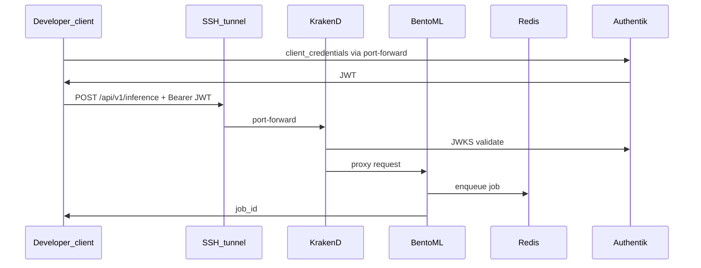

# Development Environment: Stencil Virtual Datacenter

## Why this exists

Building and testing an API with Kubernetes, JWT validation, and async job queues requires running those systems for real — not mocks. Mocks hide failures in scheduling, OIDC validation, and gateway proxy behavior.

A realistic deployment needs multiple nodes and an identity server. **Stencil** runs a full virtual datacenter on one physical machine: KVM VMs running the same K3s, Ceph, and FreeIPA stack used in production datacenters.

This platform was developed and validated in Stencil before production handoff. The **same generator output** (`services/<id>/generated/`) targets dev (automated deploy) and prod (manual kubectl); only overlay values change.

**Stencil** is an open-source AREA Science Park project:
> https://gitlab.com/area7/datacenter/codes/stencil/docs/-/tree/main/docs

For the shared Stencil layers (virtualization → K3s), see the [Bucket Explorer development overview](https://github.com/luisfpal/s3bucket_manager_app/blob/main/docs/dev-environment-overview.md). That doc uses TEST-NET-2 (`198.51.100.0/24`); this project validates on **`192.168.132.0/24`** with the same topology.

---

## Host machine requirements

Ten KVM VMs run on one host.

| Component | Minimum | Recommended | Why |
|-----------|---------|-------------|-----|
| CPU | 8 physical cores | 16+ | ~38 vCPUs across VMs |
| RAM | 64 GB | 128 GB | VMs allocate ~39 GB |
| Disk | 300 GB SSD | 500 GB NVMe | Ceph OSD + image layers |
| Network | 1 Gbit/s | 1 Gbit/s | Image pulls |

Below 64 GB RAM, reduce VM sizes in `vars.json` — behavior may differ from the validated configuration.

---

## Architecture overview

```
┌─────────────────────────────────────────────────────────────────────┐
│                     ONE PHYSICAL MACHINE                             │
│  Layer 1: KVM VMs (OpenTofu)          192.168.132.0/24             │
│  Layer 2: Ceph (Ansible)                                           │
│  Layer 3: FreeIPA (Ansible)                                          │
│  Layer 4: K3s HA — .10 / .11 / .12 (Flannel, Traefik)              │
└─────────────────────────────────────────────────────────────────────┘
```

---

## IP address map (validated dev cluster)

| Address | Role |
|---------|------|
| 192.168.132.10 | K3s init node; SSH tunnel target |
| 192.168.132.11–12 | K3s control plane members |
| Pod / Service CIDRs | Internal cluster networking |

Other Stencil deployments may use a different block with the same layout. Use addresses from your `vars.json`.

---

## Additions for this project

### Container registry (GHCR)

Images: `ghcr.io/<ghcr_owner>/<service-id>:latest` (`ghcr_owner` in [`ml_platform/config.yaml`](../ml_platform/config.yaml)).

- **Push:** `GHCR_TOKEN` in `k8s/.env` (gitignored).
- **Pull (K3s):** package must be **Public** on GitHub (no `imagePullSecrets` on nodes).

Same image path in dev and prod; prod overlay may pin digest.

### Authentik (identity)

Shared namespace `authentik-reusable-ml-services`, deployed by `make infra-deploy`. Each API gets its own OAuth2 application via `make infra-configure SERVICE=<id>`.

Tokens use **client_credentials** (machine-to-machine), not browser OAuth.

### Gateway JWT validation (dev vs prod)

| Environment | JWKS source | Generated by |
|-------------|-------------|--------------|
| Dev | In-cluster Authentik HTTP | `make render` → `generated/dev/gateway-settings.json` |
| Prod | External HTTPS URLs | `make render-prod` from `prod.overlay.yaml` |

Dev settings use `disable_jwk_security: true` because Authentik is reached in-cluster without public TLS. **Never use dev JWKS settings in production.**

Optional dev override (rare): `services/<id>/gateway-settings.local.json` (gitignored). `k8s/app.sh` picks local → generated → workaround duplicate automatically.

### Ingress vs port-forward

Prod manifests include ingress (`generated/prod/k8s/05-ingress.yaml`, `haproxy-4`). Dev may apply optional `05-ingress.dev.yaml`.

Day-to-day development uses **`make access SERVICE=<id>`** — SSH tunnel + KrakenD/Authentik port-forwards — not ingress hostnames.

### Namespaces

| Namespace | Contents | Deployed by |
|-----------|----------|-------------|
| `authentik-reusable-ml-services` | Authentik, infra PostgreSQL/Redis | `make infra-deploy` |
| `sem-classifier` | KrakenD, BentoML, Redis, PostgreSQL, HPA | `make deploy SERVICE=sem-classifier` |
| `sem-scale-classifier` | Same stack, second model | `make deploy SERVICE=sem-scale-classifier` |

Namespace names are set explicitly in `service.yaml` → `kubernetes.namespace` (dev) and `prod.overlay.yaml` (prod) — not inferred from directory names.

The cluster may host other projects (e.g. Bucket Explorer on port 3000). Namespace isolation keeps workloads separate.

---

## Request path (authenticated inference)



Core operation does not require Ceph. Optional `image_url` jobs fetch over HTTP(S) from the BentoML pod.

---

## Port allocation on the developer machine

When `make access` is running:

| Port | Service | Project |
|------|---------|---------|
| 8080 | KrakenD | sem-classifier |
| 8082 | KrakenD | sem-scale-classifier |
| 9001 | Authentik token | sem-classifier |
| 9002 | Authentik token | sem-scale-classifier |
| 9000 | Authentik | s3bucket_manager_app |
| 3000 | Frontend | s3bucket_manager_app |
| 16443 | K3s API tunnel | shared |

---

## Relationship to production

| Aspect | Development (Stencil) | Production |
|--------|----------------------|------------|
| Infrastructure | KVM VMs on one host | Datacenter servers |
| Kubernetes | Shared K3s dev cluster | Platform-managed cluster |
| Reachability | Port-forward (`make access`) | Ingress / load balancer |
| Registry | GHCR public package | GHCR or institution registry |
| Identity | In-cluster Authentik | Platform Authentik (external URLs) |
| Auth pattern | JWT RS256 via JWKS | Same pattern |
| Deploy | `make deploy` → `k8s/app.sh` | Manual `kubectl apply` from `generated/prod/apply-order.txt` |
| Config source | `service.yaml` + `ml_platform/config.yaml` | + `prod.overlay.yaml` + external secrets |

**App manifests are generated** under `services/<id>/generated/{dev,prod}/k8s/`. Legacy `k8s/manifests/app/` is removed. `k8s/manifests/` holds **infra only** (Authentik templates).

---

## Next steps

- [Development environment setup](dev-environment-setup.md) — credentials and deploy commands
- [Dev deployment operations](dev-deployment-operations.md) — redeploy classes and troubleshooting
- [Production deployment](production-deployment.md) — operator handoff
