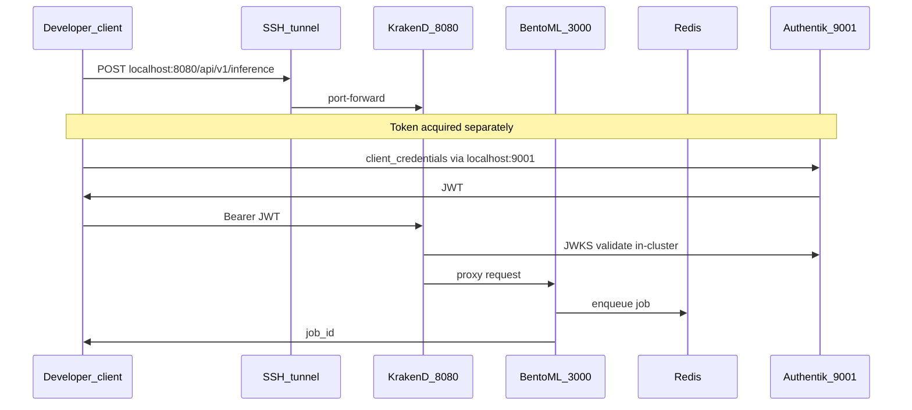

# Development Environment: Stencil Virtual Datacenter

## Why This Exists

Building and testing an API that uses Kubernetes, JWT validation, and async job queues correctly requires running those systems for real — not with mocks. Mocks of distributed scheduling, OIDC token validation, and gateway proxy behavior hide entire classes of production bugs.

The problem is that a real deployment requires multiple physical servers: at least three Kubernetes nodes and an identity server. That is not practical for a single developer during an internship.

**Stencil** solves this by running a complete virtual datacenter on one physical machine. Each server becomes a KVM virtual machine. The software inside — K3s, Ceph, FreeIPA — is the same software that runs in real datacenters. The VMs do not know they are virtual.

This project was developed and validated entirely inside a Stencil environment before any production deployment. The same Kubernetes manifests, container images, and deployment scripts that ran in the virtual cluster will run in production with only environment-specific configuration changes (hostnames, JWKS URLs, credentials).

**Stencil is an open-source project by AREA Science Park.** The original repositories and documentation live at:
> https://gitlab.com/area7/datacenter/codes/stencil/docs/-/tree/main/docs

For a full walkthrough of the shared Stencil layers (virtualization, Ceph, FreeIPA, K3s), see the [Bucket Explorer development environment overview](https://github.com/luisfpal/s3bucket_manager_app/blob/main/docs/dev-environment-overview.md). That document uses the TEST-NET-2 documentation block (`198.51.100.0/24`); this project uses the **orfeo-vm** cluster at `192.168.132.0/24` with the same topology pattern.

---

## Host Machine Requirements

The virtual datacenter runs ten KVM virtual machines on a single physical host.

| Component | Minimum | Recommended | Why |
|-----------|---------|-------------|-----|
| CPU | 8 physical cores | 16+ cores | 10 VMs share ~38 vCPUs; saturation during Ceph rebuilds and K3s deployments is common on 8 cores |
| RAM | 64 GB | 128 GB | VMs allocate ~39 GB; below 64 GB risks OOM kills on Ceph OSD nodes |
| Disk | 300 GB SSD | 500 GB NVMe | Ceph OSD data plus root filesystems; spinning disk stalls the Ceph cluster |
| Network | 1 Gbit/s | 1 Gbit/s | Inter-VM traffic is virtual; physical NIC speed matters mainly for image pulls |

**RAM is the hard constraint.** If your machine has less than 64 GB, reduce VM RAM in `vars.json` before provisioning — but Ceph and K3s behavior will differ from the validated configuration.

---

## Architecture Overview

The virtual datacenter has four layers. Each layer is an independent subsystem deployed by its own provisioning project.

```
┌─────────────────────────────────────────────────────────────────────┐
│                     ONE PHYSICAL MACHINE (orfeo-vm)                  │
│                                                                       │
│  ┌─────────────────────────────────────────────────────────────────┐ │
│  │  LAYER 1 — VIRTUALIZATION (tofu-libvirt)                        │ │
│  │  10 VMs on network 192.168.132.0/24 (KVM via OpenTofu)         │ │
│  └────────────────────────────┬─────────────────────────────────────┘ │
│                               │                                       │
│  ┌────────────────────────────▼─────────────────────────────────────┐ │
│  │  LAYER 2 — DISTRIBUTED STORAGE (ceph-provisioning)              │ │
│  │  Ceph cluster + Rados Gateway (S3-compatible API)               │ │
│  └────────────────────────────┬─────────────────────────────────────┘ │
│                               │                                       │
│  ┌────────────────────────────▼─────────────────────────────────────┐ │
│  │  LAYER 3 — IDENTITY & DNS (freeipa-provisioning)                │ │
│  │  FreeIPA: DNS, Kerberos, LDAP, CA                               │ │
│  └────────────────────────────┬─────────────────────────────────────┘ │
│                               │                                       │
│  ┌────────────────────────────▼─────────────────────────────────────┐ │
│  │  LAYER 4 — KUBERNETES (kubernetes-provisioning)                 │ │
│  │  K3s 3-node HA: 192.168.132.10 / .11 / .12                     │ │
│  │  Flannel CNI │ Traefik IngressClass                              │ │
│  └──────────────────────────────────────────────────────────────────┘ │
└─────────────────────────────────────────────────────────────────────┘
```

---

## IP Address Map (orfeo-vm cluster)

| Address / Range | Node or Service | Role |
|-----------------|-----------------|------|
| 192.168.132.10 | kube01 | K3s control plane (init node); SSH tunnel target |
| 192.168.132.11 | kube02 | K3s control plane |
| 192.168.132.12 | kube03 | K3s control plane |
| Pod CIDR | Pod network | Internal pod IP addresses |
| Service CIDR | Service network | ClusterIP service addresses |

Other Stencil deployments (for example the Bucket Explorer project) may use a different address block with the same logical layout. Always use the addresses assigned by your Stencil `vars.json`.

---

## Additions for This Project

### Container registry (GHCR)

Container images are published to the **GitHub Container Registry** at `ghcr.io/luisfpal/sem-classifier:latest`. The developer builds with `podman` and pushes using a classic GitHub PAT (`write:packages` scope) stored in `k8s/.env` (gitignored). K3s nodes pull images without credentials when the package is **public** — the same pattern as [Bucket Explorer](https://github.com/luisfpal/s3bucket_manager_app).

GHCR was chosen because images are accessible from any environment: development and production K3s nodes pull the same image without configuring a private registry mirror or CA trust on each node.

### Authentik (identity)

Authentik runs in namespace `authentik-sem-classifier`, deployed by `k8s/infra.sh`. Tokens are obtained with **client_credentials** (machine-to-machine), not browser OAuth.

The tracked [`gateway-settings.json`](../services/<id>/generated/dev/gateway-settings.json) template matches production shape (external HTTPS JWKS, `disable_jwk_security: false`). On the Stencil dev cluster, Authentik has no public trusted HTTPS endpoint today, so operators use a **gitignored local override** copied from [`gateway-settings.dev-workaround.json.example`](../services/<id>/generated/dev/gateway-settings.dev-workaround.json): in-cluster HTTP JWKS and `disable_jwk_security: true`. **Never use that workaround in production.**

### Traefik ingress

Manifests include production ingress in `services/<id>/generated/prod/k8s/05-ingress.yaml` (`haproxy-4`, hostname-specific). Dev deploy optionally applies `05-ingress.dev.yaml` when that IngressClass exists. During development, operators typically reach the API through **`./app.sh access`**, which port-forwards KrakenD to `localhost:8080` rather than through ingress.

### Namespaces

| Namespace | Contents | Deployed by |
|-----------|----------|-------------|
| `authentik-sem-classifier` | Authentik server, worker, PostgreSQL, Redis | `infra.sh` |
| `sem-classifier` | KrakenD, BentoML, Redis, PostgreSQL, HPA | `app.sh` |

The same orfeo-vm cluster also hosts other projects (for example Bucket Explorer on port `3000`). Namespace isolation keeps workloads separate.

---

## How the Application Uses This Environment

Complete request path for an authenticated inference call:



This API does not depend on Ceph for core operation. Optional `image_url` inference submits fetch images over outbound HTTP(S) from the BentoML pod.

---

## Port Allocation on the Developer Machine

When `./app.sh access` is running, these local ports are in use:

| Port | Service | Project |
|------|---------|---------|
| 8080 | KrakenD API gateway | SEM Image Classifier API |
| 9000 | Authentik UI / token endpoint | s3bucket_manager_app |
| 9001 | Authentik token endpoint | SEM Image Classifier API |
| 16443 | K3s API (SSH tunnel) | shared |
| 3000 | Frontend | s3bucket_manager_app |

---

## Relationship to Production

| Aspect | Development (Stencil / orfeo-vm) | Production (AREA Science Park) |
|--------|----------------------------------|--------------------------------|
| Infrastructure | KVM VMs on one physical host | Physical servers in the ORFEO datacenter |
| Kubernetes | K3s (shared dev cluster) | K3s or full K8s (production cluster) |
| Ingress | Traefik; dev uses port-forward | Platform-managed ingress / load balancer |
| Registry | GHCR public package (`ghcr.io/luisfpal/sem-classifier`) | GHCR or institution registry |
| Identity | Authentik in-cluster (`infra.sh`) | Authentik platform-managed (external) |
| Auth model | JWT RS256 via JWKS (same pattern) | JWT RS256 via JWKS (same pattern) |
| Deploy path | `infra.sh` + `app.sh` (dev scripts) | Manual `kubectl apply` of `manifests/app/*` |
| Config | `k8s/env/dev/*.local.*` | `k8s/env/prod/` templates + secret manager |

Kubernetes manifests in `k8s/manifests/` require no structural changes between environments. Only overlay values change.

---

## Next Steps

To provision the cluster and deploy this API, follow the [Development Environment Setup Guide](dev-environment-setup.md).

For production deployment on an admin-managed cluster, see [Production deployment](production-deployment.md).
